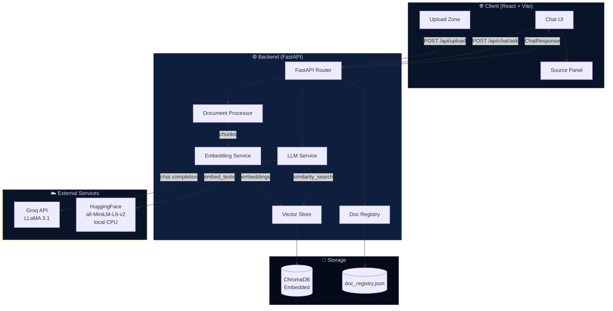
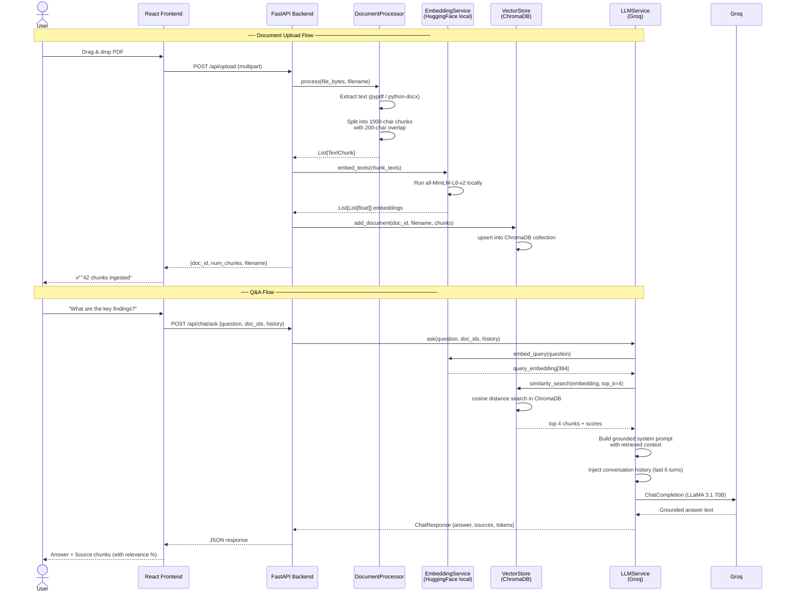
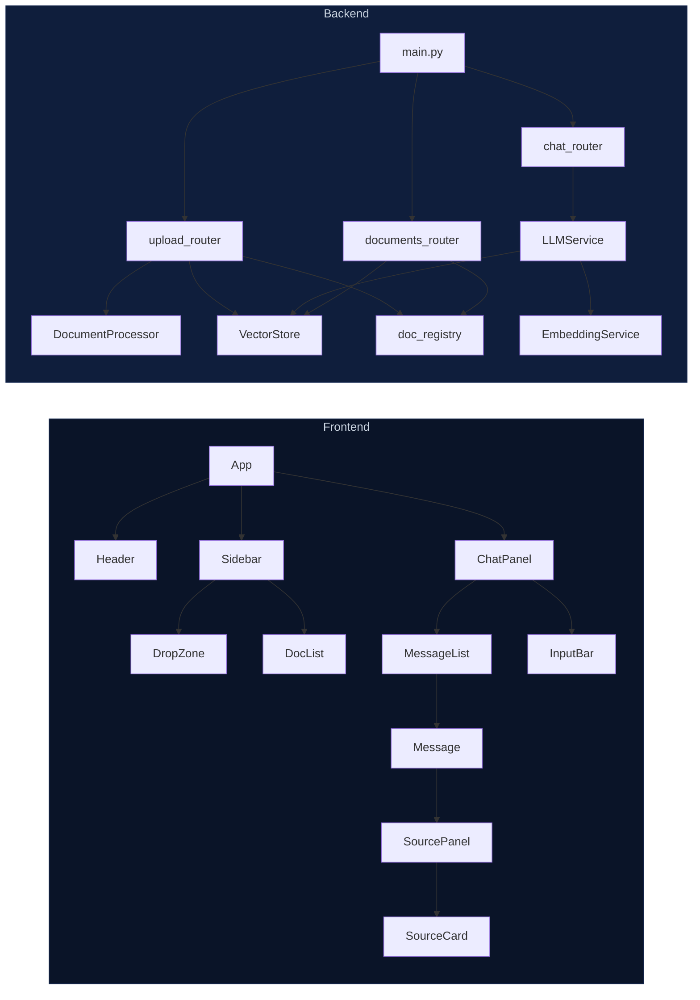
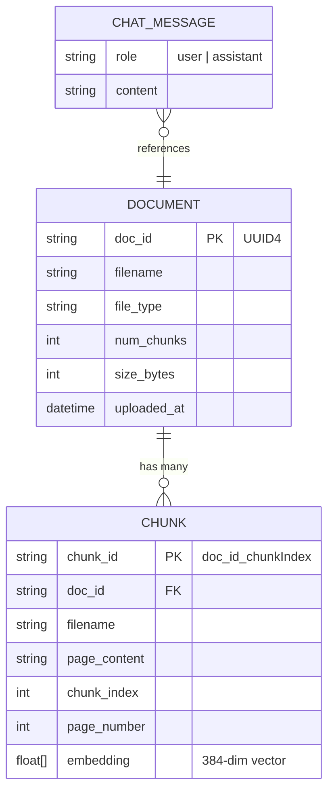

# 🧠 DocuMind — Chat with Any Document

> **RAG (Retrieval-Augmented Generation) pipeline** that lets you upload PDFs, DOCX, and TXT files, then ask questions and get grounded, source-cited answers — powered by **Groq LLaMA 3.1**, **ChromaDB**, and **HuggingFace Embeddings**.

[](https://fastapi.tiangolo.com)
[](https://react.dev)
[](https://langchain.com)
[](https://trychroma.com)
[](https://groq.com)
[](LICENSE)

---

## 📸 What it Does

| Feature | Details |
|---|---|
| 📄 **Document Upload** | PDF, DOCX, TXT — up to 20 MB. Drag-and-drop or click-to-browse |
| 🔍 **RAG Pipeline** | Chunks → Embeddings → Vector Search → LLM Answer |
| 💬 **Multi-turn Chat** | Conversation history maintained per browser session |
| 🔦 **Source Highlighting** | Every answer shows which document chunks were used + relevance scores |
| 📚 **Multi-document** | Upload many docs, filter chat to specific ones |
| ⚡ **Groq LLaMA 3.1** | Extremely fast inference, completely free |
| 💾 **Zero-cost Stack** | HuggingFace embeddings (local CPU), ChromaDB embedded, Groq free tier |

---

## 🏗️ Architecture

### High-Level System Design



---

### RAG Pipeline (Full Flow)



---

### Component Architecture



---

### Data Model



---

## 🗂️ Project Structure

```
documind/
├── backend/
│   ├── main.py                    # FastAPI app, CORS, lifespan hooks
│   ├── requirements.txt           # Python dependencies
│   ├── .env.example               # Environment variable template
│   │
│   ├── models/
│   │   └── schemas.py             # Pydantic request/response models
│   │
│   ├── routes/
│   │   ├── upload.py              # POST /api/upload — file ingestion
│   │   ├── chat.py                # POST /api/chat/ask — Q&A endpoint
│   │   └── documents.py           # GET/DELETE /api/documents — CRUD
│   │
│   ├── services/
│   │   ├── document_processor.py  # Text extraction + chunking
│   │   ├── embedding_service.py   # HuggingFace local embeddings
│   │   ├── vector_store.py        # ChromaDB wrapper
│   │   └── llm_service.py         # RAG orchestration + Groq LLM
│   │
│   └── utils/
│       └── doc_registry.py        # JSON-based document metadata store
│
├── frontend/
│   ├── index.html                 # HTML entry point
│   ├── package.json
│   ├── vite.config.js             # Vite + dev proxy config
│   ├── tailwind.config.js
│   │
│   └── src/
│       ├── main.jsx               # React root
│       ├── App.jsx                # Global state + layout
│       ├── index.css              # Global styles + Tailwind
│       │
│       ├── components/
│       │   ├── Header.jsx         # Top nav bar
│       │   ├── Sidebar.jsx        # Document upload + list
│       │   ├── ChatPanel.jsx      # Chat UI + message history
│       │   └── SourcePanel.jsx    # Retrieved chunk display
│       │
│       └── services/
│           └── api.js             # Axios API client
│
└── README.md
```

---

## ⚡ Tech Stack

| Layer | Technology | Why |
|---|---|---|
| **Backend** | Python 3.11 + FastAPI | Async, fast, auto-docs, type-safe |
| **LLM** | Groq API (LLaMA 3.1 70B) | 100% free, 10× faster than OpenAI |
| **Orchestration** | LangChain 0.3 | RAG pipeline, prompt management |
| **Vector DB** | ChromaDB (embedded) | Zero cost, zero server, persists to disk |
| **Embeddings** | HuggingFace all-MiniLM-L6-v2 | Free, local CPU, 384-dim, excellent quality |
| **PDF Parsing** | pypdf | Actively maintained, page-level metadata |
| **DOCX Parsing** | python-docx | Native DOCX support |
| **Frontend** | React 18 + Vite | Fast HMR, modern React |
| **Styling** | Tailwind CSS | Utility-first, dark theme |
| **Backend Deploy** | Render.com | Free tier, auto-deploy from GitHub |
| **Frontend Deploy** | Vercel | Free, global CDN, auto-deploy |

---

## 🚀 Quick Start (Local Development)

### Prerequisites

- Python 3.10+ and pip
- Node.js 18+ and npm
- Git

### 1. Clone the repository

```bash
git clone https://github.com/yourusername/documind.git
cd documind
```

### 2. Backend setup

```bash
cd backend
python -m venv venv
source venv/bin/activate        # Windows: venv\Scripts\activate
pip install -r requirements.txt
cp .env.example .env
# Edit .env and add your GROQ_API_KEY
```

### 3. Start the backend

```bash
uvicorn main:app --reload --port 8000
# Docs available at: http://localhost:8000/docs
```

### 4. Frontend setup (new terminal)

```bash
cd frontend
npm install
cp .env.example .env.local
npm run dev
# Opens at: http://localhost:5173
```

---

## 🔑 Getting Your API Keys

### Groq API (LLM) — Free

1. Visit [console.groq.com](https://console.groq.com)
2. Sign up / log in
3. Navigate to **API Keys** → **Create API Key**
4. Copy the key into `backend/.env` as `GROQ_API_KEY`

> Groq's free tier is extremely generous — rate limits are high enough for development and light production use.

---

## 🌐 Deployment

See `DEPLOYMENT.md` for full step-by-step instructions including:
- Backend → Render.com (free tier)
- Frontend → Vercel (free tier)
- Environment variable configuration
- Custom domain setup

---

## 🧪 API Reference

After starting the backend, interactive docs are at:
- **Swagger UI**: http://localhost:8000/docs
- **ReDoc**: http://localhost:8000/redoc

### Key endpoints

| Method | Path | Description |
|---|---|---|
| `POST` | `/api/upload/` | Upload and ingest a document |
| `GET` | `/api/documents/` | List all documents |
| `DELETE` | `/api/documents/{id}` | Delete a document |
| `POST` | `/api/chat/ask` | Ask a question (RAG) |
| `GET` | `/health` | Health check |

### Chat request example

```json
POST /api/chat/ask
{
  "question": "What are the key findings?",
  "doc_ids": ["uuid1", "uuid2"],
  "history": [
    {"role": "user", "content": "Hello"},
    {"role": "assistant", "content": "Hi! How can I help?"}
  ],
  "top_k": 4
}
```

---

## 🧩 Key Design Decisions

### Why overlapping chunks?
Text at chunk boundaries (e.g., a conclusion sentence that spans two chunks) would otherwise be lost. A 200-character overlap ensures boundary content appears in at least one chunk.

### Why cosine similarity?
Normalised HuggingFace embeddings represent direction, not magnitude. Cosine similarity captures semantic orientation without being thrown off by sentence length differences.

### Why a JSON registry instead of a database?
For a portfolio project deployed on a free tier, a JSON file is simpler to set up and zero additional cost. Replace with SQLite or PostgreSQL for production multi-user deployments.

### Why Groq instead of OpenAI?
Groq's free tier provides more than enough throughput for demos and portfolio projects, and inference is measurably faster due to their custom LPU hardware.

---

## 📄 License

MIT — see [LICENSE](LICENSE) for details.


